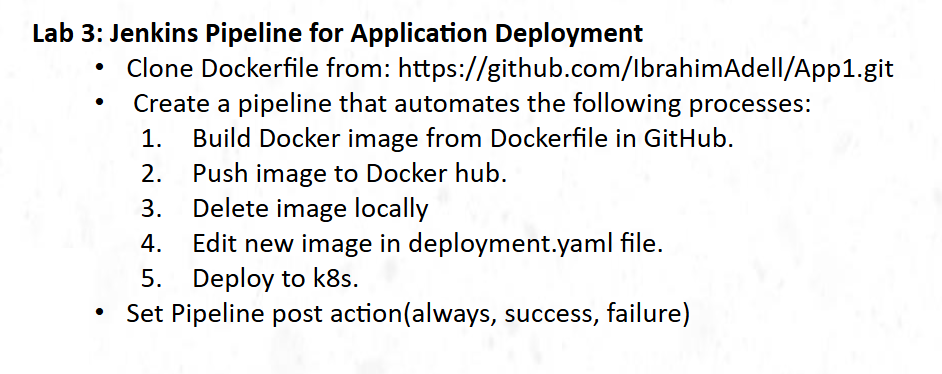
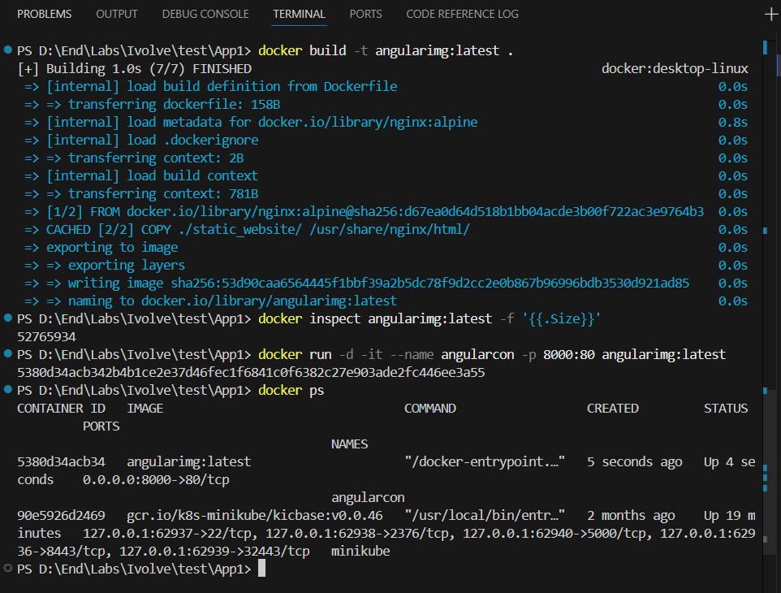
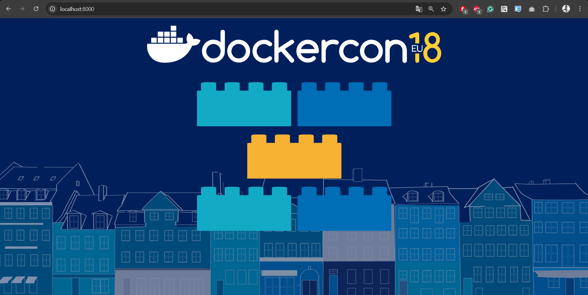
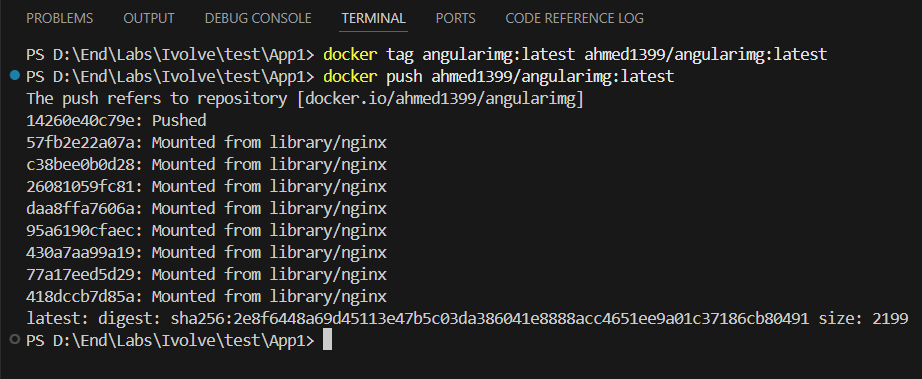
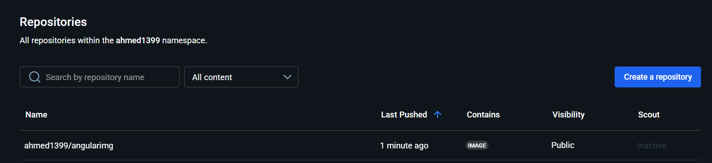
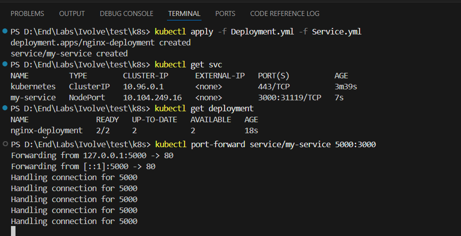
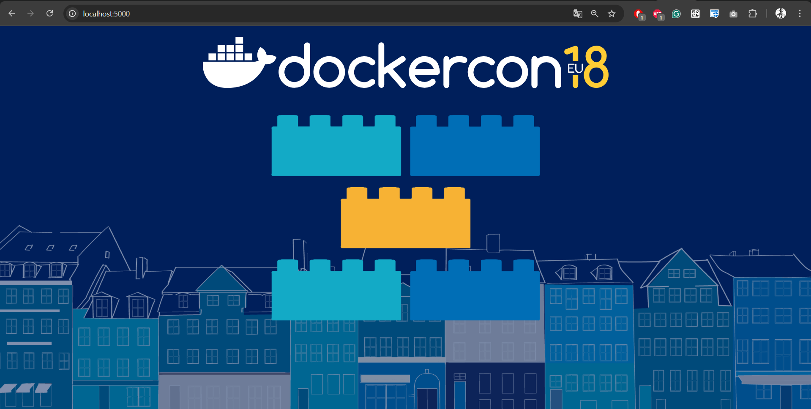
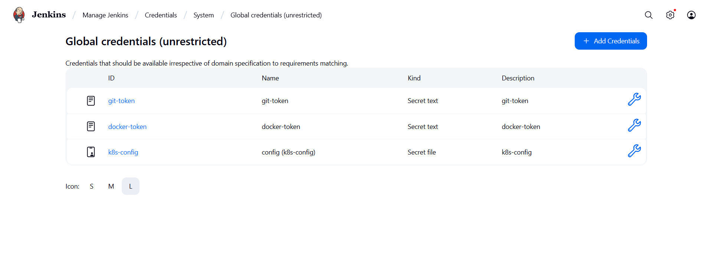
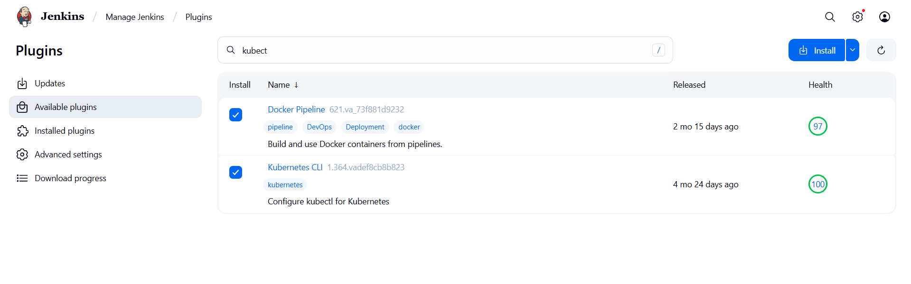

# 🚀 Lab 3

> **Jenkins Pipeline for Application Deployment**  
> This lab demonstrates how to automate the build, test, and deployment of your application using a Jenkins Pipeline. Jenkins orchestrates the entire workflow: it pulls the code from the repository, builds a Docker image, pushes it to Docker Hub, and deploys the application to a Kubernetes cluster using manifest files. This approach enables continuous integration and continuous delivery (CI/CD), ensuring rapid and reliable deployments.



```bash
git clone https://github.com/IbrahimAdell/App1.git
```

## 🧪 Test Locally with Docker
```bash
# 📝 Prepare Dockerfile
docker build -t angularimg:latest .              # Build Image
docker inspect angularimg:latest -f '{{.Size}}'  # Check Size
docker run -d -it --name angularcon -p 8000:80 angularimg:latest  # Run Container
```



## 🌐 Push Image to Docker Hub
```bash
docker tag angularimg:latest ahmed1399/angularimg:latest  # Tag Image
docker push ahmed1399/angularimg:latest                   # Push Image
```



## ⚙️ Prepare Kubernetes Manifest Files
```bash
Deployment.yml
Service.yml

kubectl apply -f Deployment.yml -f Service.yml     # Run Manifest files
kubectl get svc          # Display Services
kubectl get deployment   # Display Deployment
kubectl port-forward service/my-service 5000:3000  # Deploy App

kubectl delete -f Deployment.yml -f Service.yml    # Clean all
```



## Prepare Credentials
```bash
1️⃣ Create token for GitHub
    Settings ---> Developer Settings ---> Personal access tokens
    ---> tokens (classic) ---> Generate new token (classic)
Create Secre text credentials to add "token"

2️⃣ Create token for Docker Hub
    Settings ---> Personal access tokens ---> Generate new token

3️⃣ Add "./kube/config" file as "secret text" to access K8s cluster
```



## Install plugins
```bash
Docker pipeline
kubernetes CLI
```


